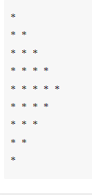
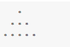

1. Write a program that will give you in hand monthly salary after deduction on CTC - HRA(10%), DA(5%), PF(3%) and taxes deduction as below:

Salary(Lakhs) : Tax(%)

- Below 5 : 0%
- 5-10 : 10%
- 10-20 : 20%
- aboove 20 : 30%

2. Write a program that take a user input of three angles and will find out whether it can form a triangle or not.

3. Write a program that will take user input of cost price and selling price and determines whether its a loss or a profit.

4. Problem 4: Write a menu-driven program 

- cm to ft
- km to miles
- USD to INR
- exit

5. Problem 5 - Exercise 12: Display Fibonacci series up to 10 terms.
Note: The Fibonacci Sequence is a series of numbers. The next number is found by adding up the two numbers before it. The first two numbers are 0 and 1. For example, 0, 1, 1, 2, 3, 5, 8, 13, 21. The next number in this series above is 13+21 = 34

6. Find the factorial of a given number.
Write a program to use the loop to find the factorial of a given number.

The factorial (symbol: !) means to multiply all whole numbers from the chosen number down to 1.

For example: calculate the factorial of 5

7. Problem 7 - Reverse a given integer number.

8. Problem 8: Take a user input as integer N. Find out the sum from 1 to N. If any number if divisible by 5, then skip that number. And if the sum is greater than 300, don't need to calculate the sum further more. Print the final result. And don't use for loop to solve this problem.

9. Write a program that keeps on accepting a number from the user until the user enters Zero. Display the sum and average of all the numbers.

10. Write a program which will find all such numbers which are divisible by 7 but are not a multiple of 5, between 2000 and 3200 (both included). The numbers obtained should be printed in a comma-separated sequence on a single line.

11. Write a program, which will find all such numbers between 1000 and 3000 (both included) such that each digit of the number is an even number. The numbers obtained should be printed in a space-separated sequence on a single line.

12. A robot moves in a plane starting from the original point (0,0). The robot can move toward UP, DOWN, LEFT and RIGHT with a given steps.
The trace of robot movement is shown as the following:

UP 5
DOWN 3
LEFT 3
RIGHT 2
!
The numbers after the direction are steps.

! means robot stop there.

Please write a program to compute the distance from current position after a sequence of movement and original point.

13. Write a program to print whether a given number is a prime number or not

14. Problem 13:Print all the Armstrong numbers in a given range.

15. Problem 14:Calculate the angle between the hour hand and minute hand.
Note: There can be two angles between hands; we need to print a minimum of two. Also, we need to print the floor of the final result angle. For example, if the final angle is 10.61, we need to print 10.

Input:
H = 9 , M = 0
Output:
90
Explanation:
The minimum angle between hour and minute hand when the time is 9 is 90 degress.

16. Given two rectangles, find if the given two rectangles overlap or not. A rectangle is denoted by providing the x and y coordinates of two points: the left top corner and the right bottom corner of the rectangle. Two rectangles sharing a side are considered overlapping. (L1 and R1 are the extreme points of the first rectangle and L2 and R2 are the extreme points of the second rectangle).

17.  Print the following pattern. Write a program to use for loop to print the following reverse number pattern.
5 4 3 2 1 
4 3 2 1 
3 2 1 
2 1 
1

18.  Print the following pattern.

19. `Problem 3`:Write a program to pring the following pattern

20.
Write a program to print the following pattern
1

2 1

3 2 1

4 3 2 1

5 4 3 2 1

21. Write a Python Program to Find the Sum of the Series till the nth term:
1 + x^2/2 + x^3/3 + … x^n/n
n will be provided by the user

22. The natural logarithm can be approximated by the following series.

If x is input through the keyboard, write a program to calculate the sum of the first seven terms of this series.

23. Write a program to calculate the sum of series up to n term. For example, if n =5 the series will become 2 + 22 + 222 + 2222 + 22222 = 24690. Take the user input and then calculate. And the output style should match which is given in the example.

24. Write a program to print all the unique combinations of 1,2,3 and 4
25. Write a program that will take a decimal number as input and prints out the binary equivalent of the number
26. : Write a program that will take 2 numbers as input and prints the LCM and HCF of those 2 numbers
27. Create Short Form from initial character
Given a string create short form ofthe string from Initial character. Short form should be capitalised.
28. Append second string in the middle of first string
29. Given string contains a combination of the lower and upper case letters. Write a program to arrange the characters of a string so that all lowercase letters should come first.
30. Take a alphanumeric string input and print the sum and average of the digits that appear in the string, ignoring all other characters.
31. Removal of all characters from a string except integers
32. Check whether the string is Symmetrical.
Statement: Given a string. the task is to check if the string is symmetrical or not. A string is said to be symmetrical if both the halves of the string are the same.
33. Reverse words in a given String
Statement: We are given a string and we need to reverse words of a given string.
34.  Find uncommon words from two Strings.
Statement: Given two sentences as strings A and B. The task is to return a list of all uncommon words. A word is uncommon if it appears exactly once in any one of the sentences, and does not appear in the other sentence. Note: A sentence is a string of space-separated words. Each word consists only of lowercase letters.
35.  Find a location of a word in a given sentence.
36. Write a program that can remove all the duplicate characters from a string. User will provide the input.
 