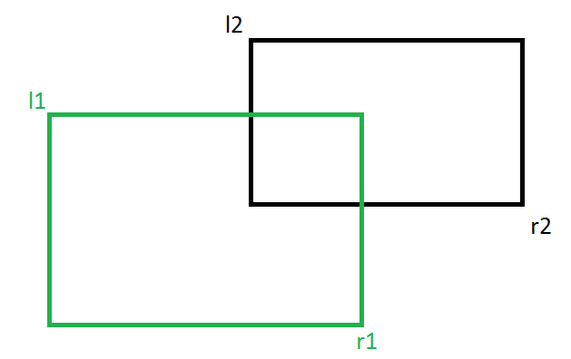
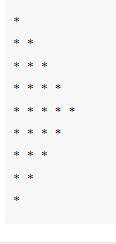
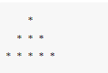
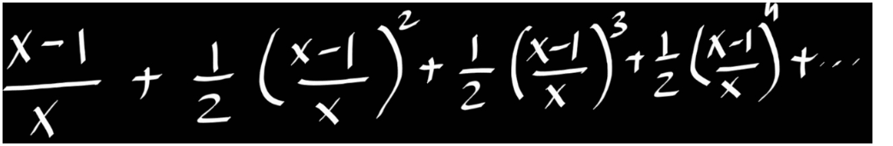

1. Write a program that will give you in hand monthly salary after deduction on CTC - HRA(10%), DA(5%), PF(3%) and taxes deduction as below:

Salary(Lakhs) : Tax(%)

- Below 5 : 0%
- 5-10 : 10%
- 10-20 : 20%
- aboove 20 : 30%

2. Write a program that take a user input of three angles and will find out whether it can form a triangle or not.

3. Write a program that will take user input of cost price and selling price and determines whether its a loss or a profit.

4. Problem 4: Write a menu-driven program 

- cm to ft
- km to miles
- USD to INR
- exit

5. Problem 5 - Exercise 12: Display Fibonacci series up to 10 terms.
Note: The Fibonacci Sequence is a series of numbers. The next number is found by adding up the two numbers before it. The first two numbers are 0 and 1. For example, 0, 1, 1, 2, 3, 5, 8, 13, 21. The next number in this series above is 13+21 = 34

6. Find the factorial of a given number.
Write a program to use the loop to find the factorial of a given number.

The factorial (symbol: !) means to multiply all whole numbers from the chosen number down to 1.

For example: calculate the factorial of 5

7. Problem 7 - Reverse a given integer number.

8. Problem 8: Take a user input as integer N. Find out the sum from 1 to N. If any number if divisible by 5, then skip that number. And if the sum is greater than 300, don't need to calculate the sum further more. Print the final result. And don't use for loop to solve this problem.

9. Write a program that keeps on accepting a number from the user until the user enters Zero. Display the sum and average of all the numbers.

10. Write a program which will find all such numbers which are divisible by 7 but are not a multiple of 5, between 2000 and 3200 (both included). The numbers obtained should be printed in a comma-separated sequence on a single line.

11. Write a program, which will find all such numbers between 1000 and 3000 (both included) such that each digit of the number is an even number. The numbers obtained should be printed in a space-separated sequence on a single line.

12. A robot moves in a plane starting from the original point (0,0). The robot can move toward UP, DOWN, LEFT and RIGHT with a given steps.
The trace of robot movement is shown as the following:

UP 5
DOWN 3
LEFT 3
RIGHT 2
!
The numbers after the direction are steps.

! means robot stop there.

Please write a program to compute the distance from current position after a sequence of movement and original point.

13. Write a program to print whether a given number is a prime number or not

14. Problem 13:Print all the Armstrong numbers in a given range.

15. Problem 14:Calculate the angle between the hour hand and minute hand.
Note: There can be two angles between hands; we need to print a minimum of two. Also, we need to print the floor of the final result angle. For example, if the final angle is 10.61, we need to print 10.

Input:
H = 9 , M = 0
Output:
90
Explanation:
The minimum angle between hour and minute hand when the time is 9 is 90 degress.

16. Given two rectangles, find if the given two rectangles overlap or not. A rectangle is denoted by providing the x and y coordinates of two points: the left top corner and the right bottom corner of the rectangle. Two rectangles sharing a side are considered overlapping. (L1 and R1 are the extreme points of the first rectangle and L2 and R2 are the extreme points of the second rectangle).

17.  Print the following pattern. Write a program to use for loop to print the following reverse number pattern.
5 4 3 2 1 
4 3 2 1 
3 2 1 
2 1 
1

18.  Print the following pattern.

19. `Problem 3`:Write a program to pring the following pattern

20.
Write a program to print the following pattern
1

2 1

3 2 1

4 3 2 1

5 4 3 2 1

21. Write a Python Program to Find the Sum of the Series till the nth term:
1 + x^2/2 + x^3/3 + … x^n/n
n will be provided by the user

22. The natural logarithm can be approximated by the following series.

If x is input through the keyboard, write a program to calculate the sum of the first seven terms of this series.

23. Write a program to calculate the sum of series up to n term. For example, if n =5 the series will become 2 + 22 + 222 + 2222 + 22222 = 24690. Take the user input and then calculate. And the output style should match which is given in the example.

24. Write a program to print all the unique combinations of 1,2,3 and 4
25. Write a program that will take a decimal number as input and prints out the binary equivalent of the number
26. : Write a program that will take 2 numbers as input and prints the LCM and HCF of those 2 numbers
27. Create Short Form from initial character
Given a string create short form ofthe string from Initial character. Short form should be capitalised.
28. Append second string in the middle of first string
29. Given string contains a combination of the lower and upper case letters. Write a program to arrange the characters of a string so that all lowercase letters should come first.
30. Take a alphanumeric string input and print the sum and average of the digits that appear in the string, ignoring all other characters.
31. Removal of all characters from a string except integers
32. Check whether the string is Symmetrical.
Statement: Given a string. the task is to check if the string is symmetrical or not. A string is said to be symmetrical if both the halves of the string are the same.
33. Reverse words in a given String
Statement: We are given a string and we need to reverse words of a given string.
34.  Find uncommon words from two Strings.
Statement: Given two sentences as strings A and B. The task is to return a list of all uncommon words. A word is uncommon if it appears exactly once in any one of the sentences, and does not appear in the other sentence. Note: A sentence is a string of space-separated words. Each word consists only of lowercase letters.
35.  Find a location of a word in a given sentence.
36. Write a program that can remove all the duplicate characters from a string. User will provide the input.
37. Combine two lists index-wise(columns wise)
38. Add new item to list after a specified item
39. Update no of items available
40. Write a program to show no. of items of each candy type.
41. Running Sum on list
42. you are given a list of integers. You are asked to make a list by running through elements of the list by adding all elements greater and itself.
i.e. Say given list is [2,4,6,10,1] resultant list will be [22,20,10,23].

For 1st element 2 ->> these are greater (4+6+10) values and 2 itself so on adding becomes 22.

For 2nd element 4 ->> greater elements are (6, 10) and 4 itself, so on adding 20

like wise for all other elememts.

[2,4,6,10,1]-->[22,20,16,10,23]

43. Find list of common unique items from two list. and show in increasing order
44. sort a list of alphanumeric strings based on product value of numeric character in it. If in any string there is no numeric character take it's product value as 1.
45. Split String of list on K character.

46. Convert Character Matrix to single String using string comprehension.
47. Add Space between Potential Words.
48. Write a program that can perform union operation on 2 lists
49. Write a program that can find the max number of each row of a matrix
50. Write a list comprehension to print the following matrix
51. Write a list comprehension that can transpose a given matrix
matrix = [
[1,2,3],
[4,5,6],
[7,8,9]
]

[1, 4, 7]
[2, 5, 8]
[3, 6, 9]

[ ]

52. Write a list comprehension that can flatten a nested list
Input
matrix = [
[1,2,3],
[4,5,6],
[7,8,9]
]

Output:
[1, 2, 3, 4, 5, 6, 7, 8, 9]

53. Join Tuples if similar initial element
While working with Python tuples, we can have a problem in which we need to perform concatenation of records from the similarity of initial element. This problem can have applications in data domains such as Data Science.

54.  Multiply Adjacent elements (both side) and take sum of right and lest side multiplication result.

55. Check is tuples are same or not?
Two tuples would be same if both tuples have same element at same index

56. Count no of tuples, list and set from a list
list1 = [{'hi', 'bye'},{'Geeks', 'forGeeks'},('a', 'b'),['hi', 'bye'],['a', 'b']]

57.  Shortlist Students for a Job role
Ask user to input students record and store in tuples for each record. Then Ask user to input three things he wants in the candidate- Primary Skill, Higher Education, Year of Graduation.

Show every students record in form of tuples if matches all required criteria.

It is assumed that there will be only one primry skill.

If no such candidate found, print No such candidate

58.     Write a program to find set of common elements in three lists using sets.
59.  Write a program to count unique number of vowels using sets in a given string. Lowercase and upercase vowels will be taken as different.
60. Write a program to Check if a given string is binary string of or not.
A string is said to be binary if it's consists of only two unique characters.

Take string input from user.

61. find union of n arrays.

62. Intersection of two lists. Intersection of two list means we need to take all those elements which are common to both of the initial lists and store them into another list. Only use using list-comprehension.

63. Key with maximum unique values
Given a dictionary with values list, extract key whose value has most unique values.
64. Replace words from Dictionary. Given String, replace it’s words from lookup dictionary.
65. Convert List to List of dictionaries. Given list values and keys list, convert these values to key value pairs in form of list of dictionaries.

66.  Convert a list of Tuples into Dictionary.
67. Sort Dictionary key and values List.
68. Write a Python function that takes a list and returns a new list with unique elements of the first list.
69. Write a Python function that accepts a hyphen-separated sequence of words as parameter and returns the words in a hyphen-separated sequence after sorting them alphabetically.
70. Write a Python function that accepts a string and calculate the number of upper case letters and lower case letters.
71. Write a Python program to print the even numbers from a given list.
72. Write a Python function to check whether a number is perfect or not.
A Perfect number is a number that is half the sum of all of its positive divisors (including itself).
73. Write a Python function to concatenate any no of dictionaries to create a new one.
74. Write a python function that accepts a string as input and returns the word with most occurence.
75. Write a python function that receives a list of integers and prints out a histogram of bin size 10
76. Write a python function that accepts a list of 2D co-ordinates and a query point, and then finds the the co-ordinate which is closest in terms of distance from the query point.
77. Write a python program that receives a list of strings and performs bag of word operation on those strings

https://en.wikipedia.org/wiki/Bag-of-words_model
78. Write a Python program to add three given lists using Python map and lambda.
79. Write a Python program to create a list containing the power of said number in bases raised to the corresponding number in the index using Python map.
80. Using filter() and list() functions and .lower() method filter all the vowels in a given string.
81. Use reduce to convert a 2D list to 1D
82.  A dictionary contains following information about 5 employees:

First name
Last name
Age
Grade(Skilled,Semi-skilled,Highly skilled)
Write a program using map/filter/reduce to a list of employees(first name + last name) who are highly skilled

83. Rectangle Class
Write a Rectangle class in Python language, allowing you to build a rectangle with length and width attributes.

Create a Perimeter() method to calculate the perimeter of the rectangle and a Area() method to calculate the area of ​​the rectangle.

Create a method display() that display the length, width, perimeter and area of an object created using an instantiation on rectangle class.

84. Create a Python class called BankAccount which represents a bank account, having as attributes: accountNumber (numeric type), name (name of the account owner as string type), balance.
Create a constructor with parameters: accountNumber, name, balance.
Create a Deposit() method which manages the deposit actions.
Create a Withdrawal() method which manages withdrawals actions.
Create an bankFees() method to apply the bank fees with a percentage of 5% of the balance account.
Create a display() method to display account details. Give the complete code for the BankAccount class.

85. omputation class
Create a Computation class with a default constructor (without parameters) allowing to perform various calculations on integers numbers.

Create a method called Factorial() which allows to calculate the factorial of an integer n. Integer n as parameter for this method

Create a method called naturalSum() allowing to calculate the sum of the first n integers 1 + 2 + 3 + .. + n. Integer n as parameter for this method.

Create a method called testPrime() in the Calculation class to test the primality of a given integer n, n is Prime or Not? Integer n as parameter for this method.

Create a method called testPrims() allowing to test if two numbers are prime between them. Two integers are prime to one another if they have only 1 as their common divisor. Eg. 4 and 9 are prime to each other.

Create a tableMult() method which creates and displays the multiplication table of a given integer. Then create an allTablesMult() method to display all the integer multiplication tables 1, 2, 3, ..., 9.

Create a static listDiv() method that gets all the divisors of a given integer on new list called Ldiv. Create another listDivPrim() method that gets all the prime divisors of a given integer.

86.  Build flashcard using class in Python.
Build a flashcard using class in python. A flashcard is a card having information on both sides, which can be used as an aid in memoization. Flashcards usually have a question on one side and an answer on the other.

Example 1:

Approach:

Create a class named FlashCard.
Initialize dictionary fruits using init() method. Here you have to define fruit name as key and it's color as value. E.g., {"Banana": "yellow", "Strawberries": "pink"}
Now randomly choose a pair from fruits by using random module and store the key in variable fruit and value in variable color.
Now prompt the user to answer the color of the randomly chosen fruit.
If correct print correct else print wrong.

87. Problem 5 based on OOP Python.

TechWorld, a technology training center, wants to allocate courses for instructors. An instructor is identified by name, technology skills, experience and average feedback. An instructor is allocated a course, if he/she satisfies the below two conditions:
- eligibility criteria:
    - if experience is more than 3 years, average feedback should be 4.5 or more
    - if experience is 3 years or less, average feedback should be 4 or more
- he/she should posses the technology skill for the course

Identify the class name and attributes to represent instructors. Write a Python program to implement the class chosen with its attributes and methods.

**Note:**
- Consider all instance variables to be private and methods to be public.
- An instructor may have multiple technology skills, so consider instance variable, technology_skill to be a list.
- *check_eligibility()*: Return true if eligibility criteria is satisfied by the instructor. Else, return false
- *allocate_course(technology)*: Return true if the course which requires the given technology can be allocated to the instructor. Else, return false.

Represent a few objects of the class, initialize instance variables using setter methods, invoke
appropriate methods and test your program.

88. Count number of instances of a class created in Python?
89. Create a deck of cards class. Internally, the deck of cards should use another class, a card class. Your requirements are:
The Deck class should have a deal method to deal a single card from the deck
After a card is dealt, it is removed from the deck.
There should be a shuffle method which makes sure the deck of cards has all 52 cards and then rearranges them randomly.
The Card class should have a suit (Hearts, Diamonds, Clubs, Spades) and a value (A,2,3,4,5,6,7,8,9,10,J,Q,K)
Deck Class

It is class of all possible cards in a deck. Total 52 cards.
Methods - deal() it will take out one card from the deck of cards.
Deck of cards should get shuffeled while creating the deck object.
no of cards remaining in deck - <number> should dsiplay on printing any deck object.
Card class

It is a class of card
Atrributes - suit and value
<suit> of <value> should dsiplay on printing any card object.

90. Q-3: Find the area of a rectangle.
Approach:

The class name should be Rectangle.
The constructor should accept two parameters length and height but you can't pass the values directly to it while creating the constructor. E.g., rectangle = Rectangle(length=10, height=8) <-- you can't do that while creating the instances.
Create a method called area() which has no parameters.
Create a method called is_square() which also has no parameters. Return True if the rectangle is a square otherwise return False.
If you are using a if-else block inside the is_square() method, then use the one-linear syntax.

91.  Problem 4
Statement: Write a program that uses datetime module within a class. Enter manufacturing date and expiry date of the product. The program must display the years, months and days that are left for expiry.

92. A university wants to automate their admission process. Students are admitted based on the marks scored in the qualifying exam. A student is identified by student id, age and marks in qualifying exam. Data are valid, if:

Age is greater than 20
Marks is between 0 and 100 (both inclusive)
A student qualifies for admission, if

Age and marks are valid and
Marks is 65 or more
Write a python program to represent the students seeking admission in the university. The details of student class are given below.

93. Create a class Scoop which has one public property flavor and one private proptery price. Take flavor values during object creation.

Create a class Bowl with private prperty scoop_list which will have list of scoopd object.

Create a method add_scoops in Bowl class which will add any no of Scoop objects given as parameter and store it in scoops_list.

Make getter and setter method for price property.

Make a method display to display flavour and price of each Scoop in scoop_list and print total price of the bowl by adding all flavour scoops prices.

Make a method sold in both Scoop class and Bowl class to print no of quantity sold.

94. Making advancement in the above classes. Scoop and Bowl

Introduce a property max_scoops in Bowl class to signify maximum scoops that a bowl can have, exceeding that it will display Bowl is full. Take default value as 3.

no_of_scoop in Scoop class with default value of 1

Print <flavour> added with every scoop added.